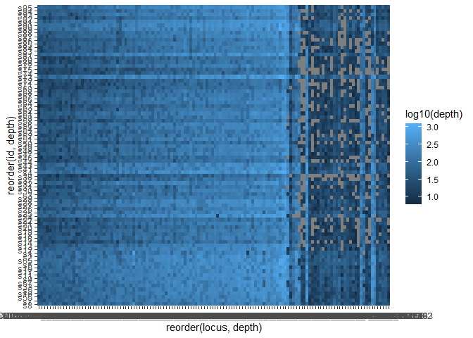

01-initial-analysis
================

2 March 2023

Looking at the first batch of genotype data for POP.

``` r
library(tidyverse)
```

    ## -- Attaching packages --------------------------------------- tidyverse 1.3.1 --

    ## v ggplot2 3.4.1      v purrr   0.3.4 
    ## v tibble  3.1.2      v dplyr   1.0.10
    ## v tidyr   1.2.0      v stringr 1.4.0 
    ## v readr   1.4.0      v forcats 0.5.1

    ## Warning: package 'ggplot2' was built under R version 4.1.3

    ## Warning: package 'tidyr' was built under R version 4.1.3

    ## Warning: package 'dplyr' was built under R version 4.1.3

    ## -- Conflicts ------------------------------------------ tidyverse_conflicts() --
    ## x dplyr::filter() masks stats::filter()
    ## x dplyr::lag()    masks stats::lag()

``` r
library(readxl)
library(stringr)
library(lubridate)
```

    ## 
    ## Attaching package: 'lubridate'

    ## The following objects are masked from 'package:base':
    ## 
    ##     date, intersect, setdiff, union

``` r
source("../R/microhaplot-genos-funcs.R")
```

``` r
genos_long <- call_genos_from_haplotRDS("../data/rds_files/POP_gtseq3.rds")
```

    ## Warning: `tbl_df()` was deprecated in dplyr 1.0.0.

    ## Warning: Please use `tibble::as_tibble()` instead.

    ## Joining, by = c("id", "locus", "rank")

``` r
genos_long %>%
  group_by(locus) %>%
  filter(!is.na(allele.balance)) %>%
  summarise(loc_depth = sum(depth)) %>%
  arrange(desc(loc_depth))
```

    ## # A tibble: 140 x 2
    ##    locus               loc_depth
    ##    <chr>                   <int>
    ##  1 CM025826.1_6377992      45544
    ##  2 CM025825.1_76785270     43506
    ##  3 CM025830.1_26009542     38184
    ##  4 CM025825.1_43208600     34437
    ##  5 CM025845.1_12625972     33263
    ##  6 CM025830.1_30507674     30061
    ##  7 CM025825.1_26537970     26924
    ##  8 CM025832.1_27265563     26200
    ##  9 CM025846.1_10099714     25960
    ## 10 CM025842.1_25291879     25699
    ## # ... with 130 more rows

Only 102 loci are in the VCF file.

## Locus evaluation

How many loci and how many alleles?

``` r
# alleles
genos_long %>%
  filter(!is.na(allele)) %>%
  select(locus, allele) %>%
  unique()
```

    ## # A tibble: 349 x 2
    ##    locus               allele                                                   
    ##    <chr>               <chr>                                                    
    ##  1 CM025825.1_24578215 AATG                                                     
    ##  2 CM025825.1_26537970 CCCA                                                     
    ##  3 CM025825.1_43208600 GAGGCTGTCCATGTTCAATCTCGTAGAG                             
    ##  4 CM025825.1_43208600 GAGGCTGTCCATGTTCAATCACGTAGAG                             
    ##  5 CM025825.1_61422707 CCTCACTGCACGGGGGCGCCCTCTGGTTGCAAAAAGAAGTCTGATTGATAGAAGTC~
    ##  6 CM025825.1_76785270 ACGGG                                                    
    ##  7 CM025825.1_7920395  TCCCCCT                                                  
    ##  8 CM025825.1_79461151 TGT                                                      
    ##  9 CM025825.1_79461151 TGG                                                      
    ## 10 CM025826.1_15801073 TTTTTACCTATTA                                            
    ## # ... with 339 more rows

``` r
# loci
genos_long %>%
  filter(!is.na(allele)) %>%
  select(locus, allele) %>%
  unique() %>%
  group_by(locus) %>%
  tally() %>%
  arrange(desc(n))
```

    ## # A tibble: 140 x 2
    ##    locus                   n
    ##    <chr>               <int>
    ##  1 CM025832.1_31942157     7
    ##  2 CM025827.1_13614142     6
    ##  3 CM025847.1_4559639      6
    ##  4 CM025827.1_14090856     5
    ##  5 CM025841.1_24413058     5
    ##  6 CM025842.1_6439981      5
    ##  7 CM025844.1_8337516      5
    ##  8 CM025845.1_23216713     5
    ##  9 CM025848.1_2715863      5
    ## 10 CM025848.1_7382130      5
    ## # ... with 130 more rows

242 alleles across 102 loci with between 1-6 alleles per locus.

Missing data:

``` r
# missing data across loci
locs_to_toss <- genos_long %>%
  group_by(locus) %>%
  mutate(missingness = ifelse(is.na(allele), 1, 0)) %>%
  summarise(sum(missingness)) %>% # 102 loci x2 = total
  filter(`sum(missingness)`>102) %>% # more than 50% missing data
  select(locus) # drop those loci for now and see how the assignment goes

# just the keepers
genos_locs_filtered <- genos_long %>%
  anti_join(., locs_to_toss)
```

    ## Joining, by = "locus"

4 loci with \> 50% missing data. Drop those.

``` r
# summary of remaining loci
genos_locs_filtered %>%
  filter(!is.na(allele)) %>%
  select(locus, allele) %>%
  unique()
```

    ## # A tibble: 334 x 2
    ##    locus               allele                                                   
    ##    <chr>               <chr>                                                    
    ##  1 CM025825.1_24578215 AATG                                                     
    ##  2 CM025825.1_26537970 CCCA                                                     
    ##  3 CM025825.1_43208600 GAGGCTGTCCATGTTCAATCTCGTAGAG                             
    ##  4 CM025825.1_43208600 GAGGCTGTCCATGTTCAATCACGTAGAG                             
    ##  5 CM025825.1_61422707 CCTCACTGCACGGGGGCGCCCTCTGGTTGCAAAAAGAAGTCTGATTGATAGAAGTC~
    ##  6 CM025825.1_76785270 ACGGG                                                    
    ##  7 CM025825.1_7920395  TCCCCCT                                                  
    ##  8 CM025825.1_79461151 TGT                                                      
    ##  9 CM025825.1_79461151 TGG                                                      
    ## 10 CM025826.1_15801073 TTTTTACCTATTA                                            
    ## # ... with 324 more rows

``` r
genos_locs_filtered %>%
  filter(!is.na(allele)) %>%
  select(locus, allele) %>%
  unique() %>%
  group_by(locus) %>%
  tally() %>%
  arrange(desc(n))
```

    ## # A tibble: 130 x 2
    ##    locus                   n
    ##    <chr>               <int>
    ##  1 CM025832.1_31942157     7
    ##  2 CM025827.1_13614142     6
    ##  3 CM025847.1_4559639      6
    ##  4 CM025827.1_14090856     5
    ##  5 CM025841.1_24413058     5
    ##  6 CM025842.1_6439981      5
    ##  7 CM025844.1_8337516      5
    ##  8 CM025845.1_23216713     5
    ##  9 CM025848.1_2715863      5
    ## 10 CM025848.1_7382130      5
    ## # ... with 120 more rows

99 loci with 1-6 alleles per locus.

``` r
# QC check
genos_long %>%
  group_by(id, locus) %>% # there should be no more than 2 alleles for a given indiv/locus
  tally() %>%
  filter(n > 2)
```

    ## # A tibble: 0 x 3
    ## # Groups:   id [0]
    ## # ... with 3 variables: id <chr>, locus <chr>, n <int>

## Missing data in individuals

Total number of loci = 99 Total number of gene copies = 198

Total number of samples = 95

``` r
# 25% missing data
198*0.25
```

    ## [1] 49.5

``` r
inds_to_toss <- genos_locs_filtered %>%
  group_by(id) %>%
  mutate(missingness = ifelse(is.na(allele), 1, 0)) %>%
  summarise(sum(missingness)) %>%
  arrange(desc(`sum(missingness)`)) %>%
  filter(`sum(missingness)` > 50) # remove samples with >25% missing data

# just the keepers
genos_locs_ind_filtered <- genos_locs_filtered %>%
  anti_join(., inds_to_toss)
```

    ## Joining, by = "id"

How many indivs retained?

``` r
genos_locs_ind_filtered %>%
  select(id) %>%
  unique()
```

    ## # A tibble: 82 x 1
    ##    id   
    ##    <chr>
    ##  1 s1   
    ##  2 s10  
    ##  3 s11  
    ##  4 s12  
    ##  5 s13  
    ##  6 s14  
    ##  7 s15  
    ##  8 s16  
    ##  9 s17  
    ## 10 s18  
    ## # ... with 72 more rows

Take a look at that dataset

``` r
genos_locs_ind_filtered  %>%
  #unite(gtseq_run, id, col = "sample", remove = F) %>%
  ggplot(aes(x = reorder(locus, depth), y = reorder(id, depth), fill = log10(depth))) +
  geom_tile()
```

<!-- -->

``` r
ggsave("pdf_outputs/POPheatmap.pdf")
```

    ## 

    ## Saving 7 x 5 in image

That’s a strange pattern - with NAs for some individuals in some of the
higher read depth loci. Variation in the primer sites across POP groups?

Quick look at a PCA before getting the expected population information
for POP groups/ABLG numbers.

## Taking data through to a PCA

If that’s the case, just take a peak at a PCA for these filtered
genotypes to evaluate whether there’s any obvious structure among these
bycatch samples.

The format I need for the PCA is strata, indiv, markers, genotype
(allele idx)

``` r
# first make integers of the alleles
alle_idxs <- genos_locs_ind_filtered %>% 
  dplyr::select(id, locus, gene_copy, allele) %>%
  group_by(locus) %>%
  mutate(alleidx = as.integer(factor(allele, levels = unique(allele)))) %>%
  ungroup() %>%
  arrange(id, locus, alleidx) # rubias can handle NA's, so no need to change them to 0's
```

Make the df match the requirements for tidy_genomic_data

``` r
long_df <- alle_idxs %>%
  select(-allele, -gene_copy) %>%
  mutate(group = "POP") %>%
  #left_join(., spp_indiv) %>%
  #select(species, everything()) %>%
  rename(INDIVIDUALS = id, STRATA = group, MARKERS = locus, GT = alleidx)
```

Genotypes should be coded with 3 integers for each alleles. 6 integers
in total for the genotypes. e.g. 001002 or 111333 (for heterozygote
individual). 6 integers WITH separator: e.g. 001/002 or 111/333 (for
heterozygote individual). The separator can be any of these: “/”, “:”,
“\_“,”-“,”.”, and will be removed.

Add population information from metadata:

``` r
# metadata for reference samples
meta1 <- read_csv("../data/pop_335_population_assignment.csv")
```

    ## 
    ## -- Column specification --------------------------------------------------------
    ## cols(
    ##   ABLG = col_character(),
    ##   pop_assign = col_character(),
    ##   pop = col_character()
    ## )

``` r
samplelist <- read_csv("../data/samplesheets/20230131POPtest4_BFALtest4_KGLibs.csv", skip = 19)
```

    ## 
    ## -- Column specification --------------------------------------------------------
    ## cols(
    ##   Sample_ID = col_character(),
    ##   Sample_Plate = col_character(),
    ##   Sample_Well = col_character(),
    ##   I7_Index_ID = col_character(),
    ##   index = col_character(),
    ##   I5_Index_ID = col_character(),
    ##   index2 = col_character(),
    ##   Sample_Project = col_character(),
    ##   Description = col_character(),
    ##   s_id = col_character()
    ## )

``` r
metadata <- samplelist %>%
  inner_join(., meta1, by = c("Sample_ID" = "ABLG")) %>%
  mutate(population = pop_assign) %>%
  select(Sample_ID, s_id, population, pop)

metadata %>% head()
```

    ## # A tibble: 6 x 4
    ##   Sample_ID s_id  population pop  
    ##   <chr>     <chr> <chr>      <chr>
    ## 1 ABLG670   s1    D          clean
    ## 2 ABLG671   s2    D          clean
    ## 3 ABLG672   s3    D          clean
    ## 4 ABLG673   s4    C          clean
    ## 5 ABLG674   s5    C          clean
    ## 6 ABLG675   s6    A          clean

``` r
tmp <- long_df %>%
  left_join(., metadata, by = c("INDIVIDUALS" = "s_id"))


long_df_strata <- tmp %>%
  mutate(STRATA = population) %>%
  select(STRATA, everything()) %>%
  select(-population)
```

``` r
library("DescTools")
```

    ## Warning: package 'DescTools' was built under R version 4.1.3

``` r
# create 3 digit integers from the genotypes
long_df_strata$GT3 <- Format(long_df_strata$GT, ldigits = 3, digits = 0)

head(long_df_strata)
```

    ## # A tibble: 6 x 7
    ##   STRATA INDIVIDUALS MARKERS                GT Sample_ID pop   GT3     
    ##   <chr>  <chr>       <chr>               <int> <chr>     <chr> <Format>
    ## 1 D      s1          CM025825.1_24578215     1 ABLG670   clean 001     
    ## 2 D      s1          CM025825.1_24578215     1 ABLG670   clean 001     
    ## 3 D      s1          CM025825.1_26537970     1 ABLG670   clean 001     
    ## 4 D      s1          CM025825.1_26537970     1 ABLG670   clean 001     
    ## 5 D      s1          CM025825.1_43208600     1 ABLG670   clean 001     
    ## 6 D      s1          CM025825.1_43208600     2 ABLG670   clean 002

``` r
# fix NAs
long_df0s <- long_df_strata %>%
  mutate(GT3 = ifelse(is.na(GT3), "000", GT3))

# long_df0s %>%
#   filter(STRATA != "bycatch")
```

Now combine the GT3 column per indiv/marker:

``` r
# make the genos characters and then try pasting them as strings
long_df0s$GT3 <- as.character(long_df0s$GT3)

long_df3digit <- long_df0s %>%
  group_by(INDIVIDUALS, MARKERS) %>% 
  arrange(GT3, .by_group = TRUE) %>% 
  summarise(GENOTYPE = toString(GT3))
```

    ## `summarise()` has grouped output by 'INDIVIDUALS'. You can override using the
    ## `.groups` argument.

``` r
# paste strings together
long_df3digit$GENOTYPE <- gsub(", ","",long_df3digit$GENOTYPE)


# add back on species identity as strata
df_for_conversion <- long_df0s %>% 
  select(-GT, -GT3) %>%
  left_join(., long_df3digit) %>%
  unique() %>%
  rename(GT = GENOTYPE) %>%
  mutate(GT = ifelse(GT == "000000", NA, GT))
```

    ## Joining, by = c("INDIVIDUALS", "MARKERS")

``` r
df_for_conversion$STRATA <- as.factor(df_for_conversion$STRATA)

# check on NAs here
df_for_conversion %>%
  filter(str_detect(INDIVIDUALS, "s"))
```

    ## # A tibble: 10,660 x 6
    ##    STRATA INDIVIDUALS MARKERS             Sample_ID pop   GT    
    ##    <fct>  <chr>       <chr>               <chr>     <chr> <chr> 
    ##  1 D      s1          CM025825.1_24578215 ABLG670   clean 001001
    ##  2 D      s1          CM025825.1_26537970 ABLG670   clean 001001
    ##  3 D      s1          CM025825.1_43208600 ABLG670   clean 001002
    ##  4 D      s1          CM025825.1_61422707 ABLG670   clean 001001
    ##  5 D      s1          CM025825.1_76785270 ABLG670   clean 001001
    ##  6 D      s1          CM025825.1_7920395  ABLG670   clean 001001
    ##  7 D      s1          CM025825.1_79461151 ABLG670   clean 001002
    ##  8 D      s1          CM025826.1_15801073 ABLG670   clean 001001
    ##  9 D      s1          CM025826.1_22563832 ABLG670   clean 001001
    ## 10 D      s1          CM025826.1_36818699 ABLG670   clean 001001
    ## # ... with 10,650 more rows

``` r
# how many loci in the df for the PCA?
df_for_conversion %>%
  select(MARKERS) %>%
  unique()
```

    ## # A tibble: 130 x 1
    ##    MARKERS            
    ##    <chr>              
    ##  1 CM025825.1_24578215
    ##  2 CM025825.1_26537970
    ##  3 CM025825.1_43208600
    ##  4 CM025825.1_61422707
    ##  5 CM025825.1_76785270
    ##  6 CM025825.1_7920395 
    ##  7 CM025825.1_79461151
    ##  8 CM025826.1_15801073
    ##  9 CM025826.1_22563832
    ## 10 CM025826.1_36818699
    ## # ... with 120 more rows

``` r
library(radiator)
# use the radiator package for this conversion
genind_df <- write_genind(df_for_conversion)
```

    ## Registered S3 method overwritten by 'gdata':
    ##   method         from     
    ##   reorder.factor DescTools

    ## Registered S3 method overwritten by 'spdep':
    ##   method   from
    ##   plot.mst ape

Now that the data is a genind object, go ahead and run the PCA.

Make PCA

``` r
library(adegenet)
```

    ## Loading required package: ade4

    ## 
    ##    /// adegenet 2.1.3 is loaded ////////////
    ## 
    ##    > overview: '?adegenet'
    ##    > tutorials/doc/questions: 'adegenetWeb()' 
    ##    > bug reports/feature requests: adegenetIssues()

``` r
# Allele presence absence data are extracted and NAs replaced using tab:
datasetX <- tab(genind_df, NA.method="mean") # double check that is this the appropriate method.

# make PCA
dataset_pca1 <- dudi.pca(datasetX, center = TRUE, scannf = FALSE, scale=FALSE, nf = 1000)

# colors
mycol <- colorRampPalette(c("darkgreen", "deepskyblue", "orange", "brown", "magenta", "cyan", "darkblue", "midnightblue", "blue", "dodgerblue", "darkcyan", "darkslateblue", "slateblue", "steelblue4", "skyblue", "paleturquoise4", "brown", "royalblue", "purple4", "orange", "darkorange", "darkgoldenrod", "chocolate", "tan4", "saddlebrown", "sienna", "navajowhite4", "darkgray", "black", "pink"))(55)

# plot with factor labels
pdf("pdf_outputs/POPgtseq_test3_pca.pdf", width = 10, height = 10)
s.class(dataset_pca1$li, fac=pop(genind_df), wt = rep(1, length(pop(genind_df))), clabel = .8, grid = FALSE, cellipse = 2,
        xax=1, yax=2, col=transp(mycol,.8),
        axesel=FALSE, cstar=0, cpoint=1)
dev.off()
```

    ## png 
    ##   2

I think the PCA is very sensitive to missing data because NA is coded as
000, which would make the genotypes more similar?

Just look at the group B samples:

``` r
# group B
b_grp <- df_for_conversion %>%
  filter(str_detect(STRATA, "B"))


b_genind <- write_genind(b_grp)
```

Make PCA

``` r
library(adegenet)
# Allele presence absence data are extracted and NAs replaced using tab:
datasetB <- tab(b_genind, NA.method="mean") # double check that is this the appropriate method.

# make PCA
dataset_pcaB <- dudi.pca(datasetB, center = TRUE, scannf = FALSE, scale=FALSE, nf = 1000)

# colors
mycol <- colorRampPalette(c("darkgreen", "deepskyblue", "orange", "brown", "magenta", "cyan", "darkblue", "midnightblue", "blue", "dodgerblue", "darkcyan", "darkslateblue", "slateblue", "steelblue4", "skyblue", "paleturquoise4", "brown", "royalblue", "purple4", "orange", "darkorange", "darkgoldenrod", "chocolate", "tan4", "saddlebrown", "sienna", "navajowhite4", "darkgray", "black", "pink"))(55)

# plot with factor labels
pdf("pdf_outputs/POPgtseq_grpB_pca.pdf", width = 10, height = 10)
s.class(dataset_pcaB$li, fac=pop(b_genind), wt = rep(1, length(pop(b_genind))), clabel = .8, grid = FALSE, cellipse = 2,
        xax=1, yax=2, col=transp(mycol,.8),
        axesel=FALSE, cstar=0, cpoint=1)
dev.off()
```

    ## png 
    ##   2

\*Note to self - I need to wrap up the PCA data prep into a function.
